#     Wise (formerly TransferWise) - Case Study

## **Introduction to Fintech**

Financial technology (FinTech) is a term used to describe the usage and advancement of technology with the aim to improve and automate delivery and use of financial services. When the term emerged at the beginning of the century, it was initially applied to applied to the technology employed at the back-end systems of established financial institutions. But there has been shift to more consumer-oriented services since then. This is why FinTech is now an umbrella term that includes sectors like education, retail, open banking, robo-advising, investment management, money transfer and remittance and many more. The following image shows different FinTech domains and some major players in each domain.

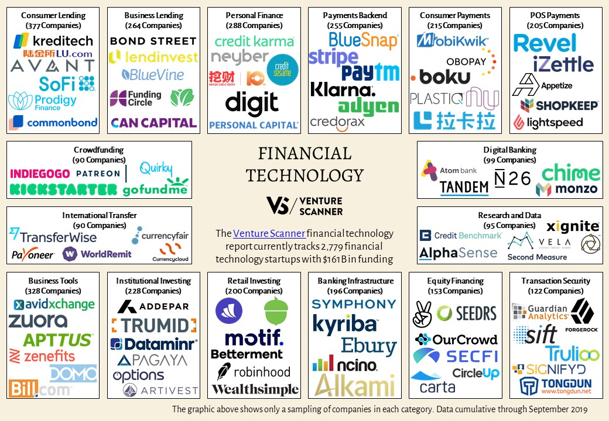

This case study will focus on one of the unicorns of Fintech industry, **Wise, a company that provides remittance and money transfer services.** To put in context, remittance means to send money from a domestic account to a foreign account and money transfer means to send money from one account to another account which can be domestic or international. This would make remittance a subset of money transfer.
 

## **Overview and Origin**

### **Name of the company**

*Wise*, a company that provides remittance and money transfer services. It was formerly known as *TransferWise*. The rationale behind the name change is to highlight the company's expanded portfolio of services. 

As Kristo Käärmann, CEO and cofounder puts it **“Our name catches up with who we’re already building for — a community of people and businesses with multi-currency lives. We’ve evolved to fix more than just money transfer, but the core experience of using Wise will remain.”**

### **When was the company incorporated?**

Wise was incorporated 10 years ago in *January 2011*. It is headquartered in *London, United Kingdom*.

### **Who are the founders of the company?**

*Kristo Käärmann* and *Taavet Hinrikus* are the co-founders of the Wise.

### **How did the idea for the company (or project) come about?**

Like most great products, Wise was created to solve the founders’ problem. When Taavet Hinrikus and Kristo Käärmann were sending money between the UK and their home country of Estonia, a lot less money arrived than expected. Each time the bank took a fee, hidden inside the exchange rate.

They worked out a simple solution: Taavet put his euros into Kristo’s Estonian bank account, and Kristo topped up Taavet’s UK bank account using his pounds. The funds never crossed the borders, so neither paid obscure charges and both got the currency they needed almost instantly.

It seemed that many people faced the same problem. Having validated this hypothesis with their friends in Estonia and London via a simple Skype chat, they decided to take their personal money savings model to the broader market and came up with Wise.

The company’s peer-to-peer model is not entirely new. It traces its roots to Hawala, an informal method of transferring money without any physical money actually moving. It is described as a "money transfer without money movement." Another definition is simply "trust."

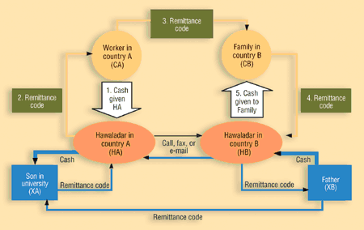

Thanks to the crowdsourcing approach, the company is able to charge 5–10x less in fees than traditional banks.

### **How is the company funded? How much funding have they received?**

Wise has received multiple rounds of funding, detailed in the table below.

| Time          	| Funding (USD) 	| Investors                                                                                                      	|
|---------------	|---------------	|----------------------------------------------------------------------------------------------------------------	|
| August 2011 	| $72,075       	| Seedcamp                                                                                                       	|
| April 2012    	| $1.3 million  	| Max Levchin, Index Ventures, Seedcamp, IA Ventures, Kima Ventures, The Accelerator Group                       	|
| May 2013     	| $6 million    	| Index Ventures, Seedcamp, SV Angel, Valar Ventures, IA Ventures, Kima Ventures, The Accelerator Group          	|
| June 2014     	| $25 million   	| Richard Branson                                                                                                	|
| January 2015  	| $58 million   	| Andreessen Horowitz                                                                                            	|
| May 2016      	| $26 million   	| Unknown                                                                                                        	|
| November 2017 	| $280 million  	| Merian Global Investors, Institutional Venture Partners, Sapphire Ventures, Mitsui & Co., World Innovation Lab 	|
| May 2019      	| $292 million  	| Lead Edge Capital, Lone Pine Capital                                                                           	|
| July 2020     	| $319 million  	| D1 Capital Partners, Lone Pine Capital, Vulcan Capital                                                         	|
 

## **Business Activities**

### **What specific financial problem is the company or project trying to solve?**

Money transfer especially remittance is plagued with following key problems:

1. **Hidden and exorbitant fees charged by banks and private players**
2. **Opaque transfer process**
3. **Time to process the transfer**

Founders, Taavet and Kristo, both from Estonia, who worked and lived London got paid in pounds. But Kristo had mortgage in euros back in Estonia. They both had moved money with their banks -  which had expensive fees and bad exchange rates. So they came together and came up with amazingly simple solution.

Every time they wanted to make a transfer, they looked up the exchange rate on Reuters. After which, Taavet put his euros into Kristo's Estonian bank account and Kristo deposited equivalent pounds in Taavet's UK account. Both of them got the money instantly and avoided bad exchange rates or hidden fees. There was **no waiting, no stress and no extra cost**.

### **Who is the company's intended customer?  Is there any information about the market size of this set of customers?**

Wise's intended customers are:

1. **Individuals like Taavet and Kristo who would like to send money overseas**
2. **Small to medium size businesses who need to transfer money to pay their employees working remotely, pay suppliers etc.**

The following chart shows the size of remittance industry according to a survey by Aite Group in August 2019.

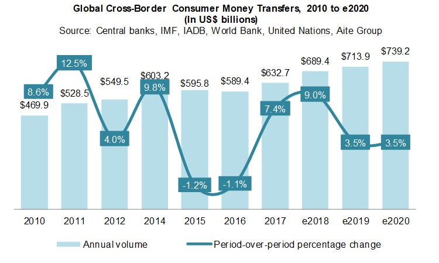

The industry is mostly dominated by conventional financial institutions and old players like Western Union but with advent of Fintech companies like Wise in this area, *Digital Remittance Volune* has seen a constant rise since the beginning of last decade. Following chart from a Business Insider 2018 report shows the rise of digital remittance volume and its projected rise.

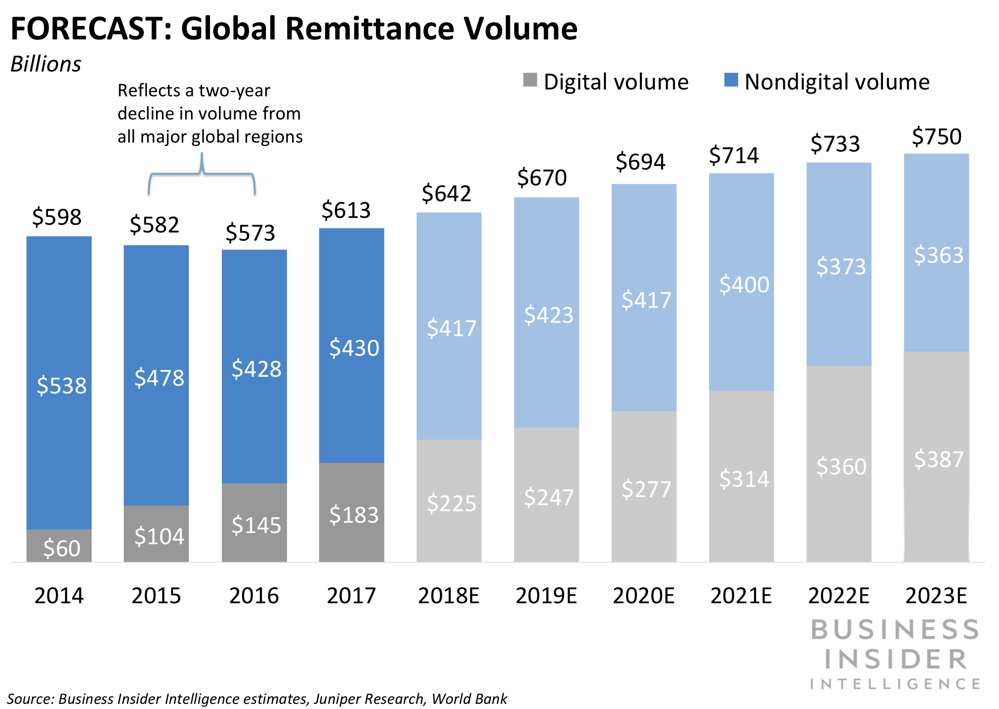

### **What solution does this company offer that their competitors do not or cannot offer? (What is the unfair advantage they utilize?)**

With Wise, money never crosses the country's border. This is the main advantage that Wise has over its competitors.

They way it works is:

1. User wants to send money for example to India from Australia
2. Using services of Wise, user sends AUD to its local account in Australia.
3. Wise finds another user who wants money in Australia and sends money to them.
4. Wise, once it receives the money in AUD, transfers money from its Indian account to the user's recipient account in India.
5. Thus, no money crosses the border.

When a peer-to-peer match is not possible, Wise becomes a market maker, using its own capital or relying on intermediaries to complete the transfer. By maintaining liquidity in countries where customers are transacting, the company avoids higher international transfer costs and is able to offer customers a faster and cheaper solution even on non-P2P routes.

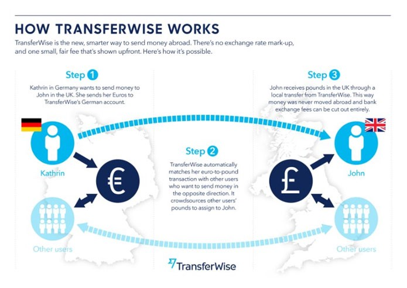

**Wise charges a small fee but no other fees and it uses mid-market exchange rate and doesn't make any money from the exchange rate. This makes Wise very hard to beat for anyone.** This is what gives Wise an unfair advantage over other competitors.

### **Which technologies are they currently using, and how are they implementing them? (This may take a little bit of sleuthing–– you may want to search the company’s engineering blog or use sites like Stackshare to find this information.)**

Wise uses a wide array of technology tools to create its products and user experience. The following screenshots show the technology stack of the company. 

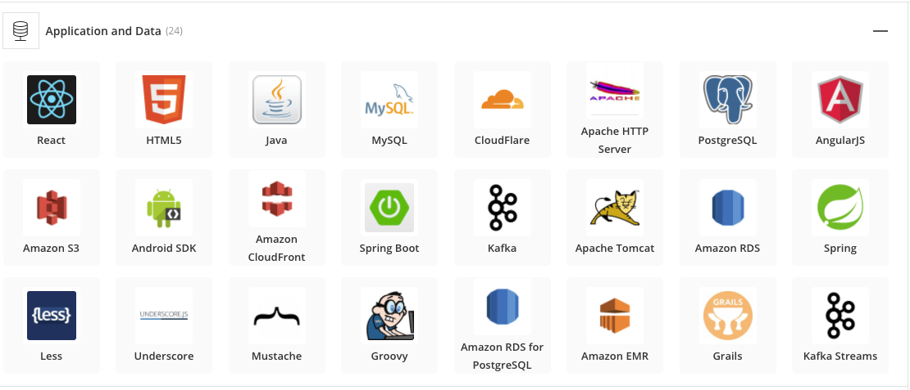

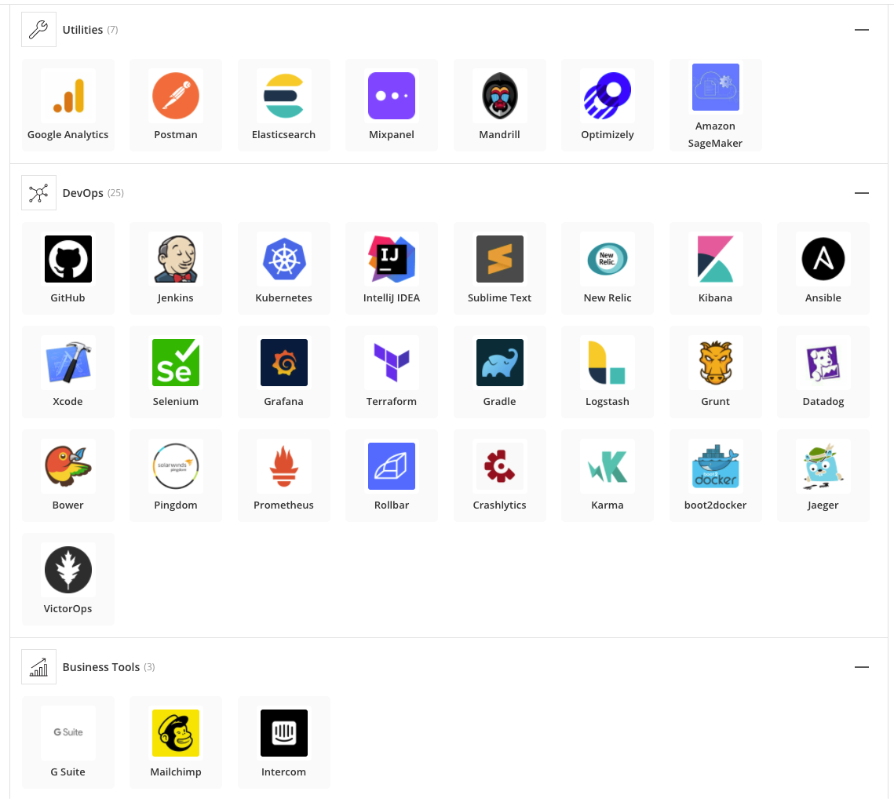

Wise platform team structure can be understood with the help of the diagram below:

1. The Wise — which is at the very heart of our solar system.
2. Several planets orbit The Wise: data, service and product — these represent our squads.
    * **The product platform squad** : The product platform squad is made up of four teams that have the biggest interface with our product engineering teams: Site Reliability Engineering, Engineering Experience, Observability and Automation and Tooling.
    * **The service platform squad** : The service platform squad consists of two teams: service platform core and service platform connect.
    * **The data squad** : The data squad is made up of database engineering, real time data platform, analytics platform and machine learning teams.
3. These planets have their own moons that are in orbit — these represent the teams within the squads.
4. The space station provides a hub for exploratory research into space — this represents the platform’s governance function that will monitor the platform and define the constraints, guardrails, and policies that determine how the platform should run.
5. Rockets zoom between our planets — these represent the teams that work across multiple squads and act as boosters to teams and other tribes (Platform Integrations and Observability).
6. We also have some comets in orbit, these curious cosmic snowballs may yield clues about the formation of our solar system — these represent the teams that surface insights with Wise data (Machine Learning and Analytics Platform)
 

## **Landscape**

### **What domain of the financial industry is the company in?**

Wise falls under *Money Transfer and Remittance* domain of the financial industry.

### **What have been the major trends and innovations of this domain over the last 5-10 years?**

Traditionally, the money transfer industry involved physically going to a local money transfer agent or a bank, following a lengthy process to be able to send money and bear high fees so that the money can make it to the other end.

On the receiving end, recipients usually had to wait several hours to days before they received the money. This is because the remittance industry has been predominantly cash based.

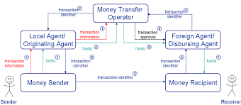

But with the advent of The Internet, smart phones, the landscape has drastically changed in last few years. Now instead of waiting hours or days and going to a bank, one can easily initiate a money transfer request on his/her phone and the recipient receives the money instantly i.e. *in matters of minutes and sometimes seconds*. Sender also gets notified of a successful transfer and the whole process has become quite transparent.

Screenshot below shows a money transfer that the author of the case study did using Wise services. As its clear from the screenshot, the recipient received the money within minutes even though there is a note saying it might take two days to credit. This is how Fintech has disrupted the domain.

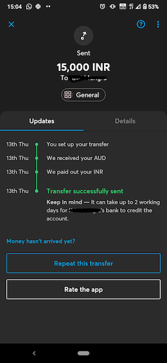

*This all has been possible because of the rise of the Fintech industry in general but also the major driver has been the fact that technology like smartphones and The Internet has become affordable and accessible to the masses.*

But these technologies are still heavily reliant on financial institutions like banks to ensure the authenticity of these transactions. But there are countries where these infrastructures are not adequate or failing and citizens of these countries are also facing hyperinflation where the value of their fiat currencies is declining rapidly. For these people, the saving grace has been *Cryptocurrency and The Blockchain*. The reason Cryptocurrency has become a saving grace is because of its decentralised architecture which means that to validate the authenticity of the transactions, no central institutions are required as everything happens digitally on the network itself.

Luis Buenaventura in his book, Reinventing Remittances with Bitcoin has pointed out how countries like the Philippines are using Bitcoin in the money transfer workflow as the last mile. Cryptocurrency technology is still quite young and it has not gained mass acceptance which is why it is not widely used method of money transfer and just being used in the last mile i.e. when a sender wants to send money internationally, companies like Bloom or BitPesa takes money in fiat currency, converts to Bitcoin in the back and sends it to the recipient's country and converts it to the local currency and delivers it to the recipient and no one is any wiser. These companies manage the risk of volatility of cryptocurrencies.

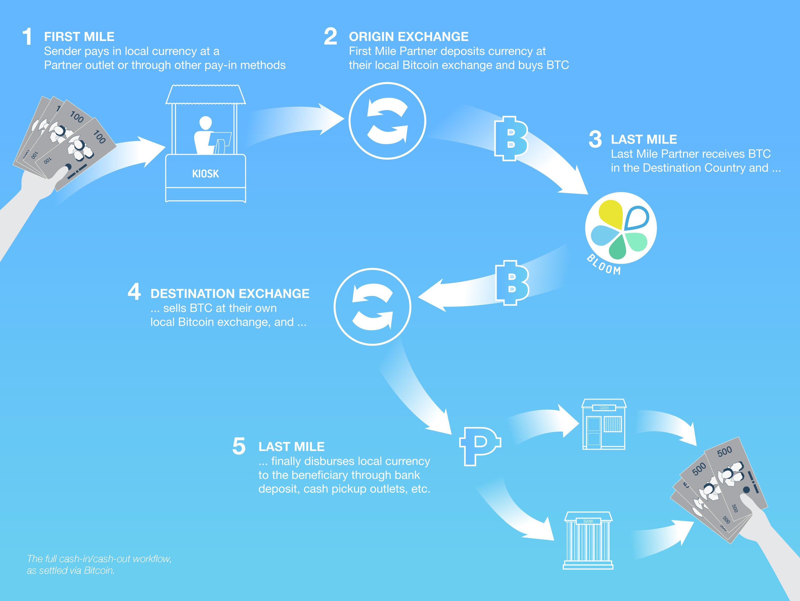

### **What are the other major companies in this domain?**

There are a lot of companies which are operating in this space. Diagram below shows the alternatives to Wise along with the fee they charge and benefit over Wise. 

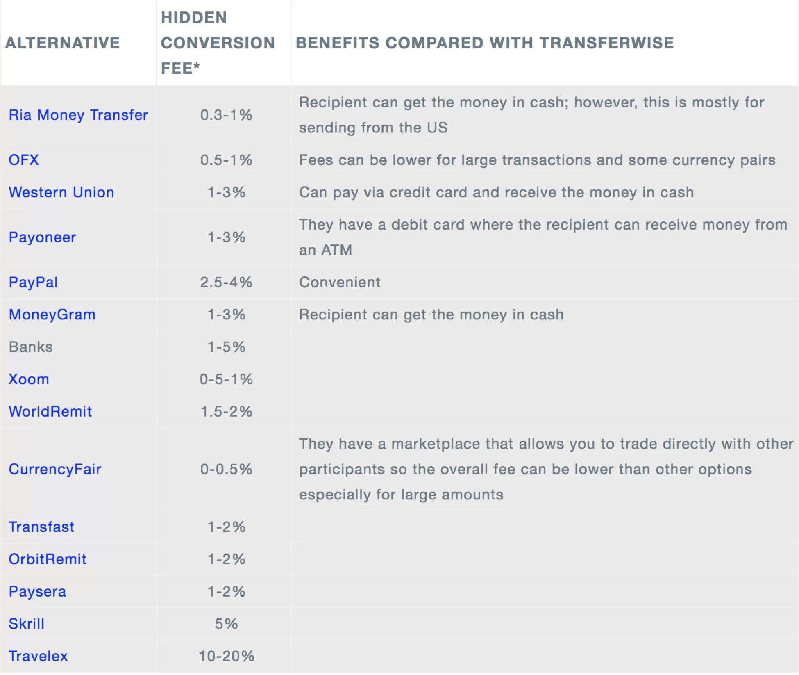

Please notes its not a comprehensive list of competitors.

 

## **Results**

### **What has been the business impact of this company so far?**

Wise was one of the first companies to openly speak about hidden fees traditional money transfer operators charge and also raised issues like transparency and fairness. It basically branded itself as the challenger brand. It lobbied UK government on implementing rules on fee transparency and in order to raise awareness about its efforts, they ran *Stop Hidden Fees* campaign and other bold and expansive guerilla marketing campaigns.

Another area where company is helping customers is *IBAN Discrimination*. This is an EU issue where a bank or business refuses to accept a certain EUR account number, which is against the law. In order to rectify the situation, Wise has partnered with other Fintech companies and launched *AcceptMyIBAN.org* and more cases have been reported in 2 weeks than the German authorities saw in 3 years.

In monetary terms, Wise has the biggest influence on FX margin. FX margin is the percentage difference between the foreign currency exchange rate applied to the transaction by the provider and the interbank exchange rate.

Following chart examines FX margin over 2011 Q1 to 2018 Q3 for remittance outflows amony six major source countries, which are Germany (DEU), Canada (CAN), United Kingdom (GBR), Italy (ITA), United States (USA) and France (FRA), charged by various providers. The chart compares the FX margins with Wise's average FX margin for remittance outflows among these six major source countries.

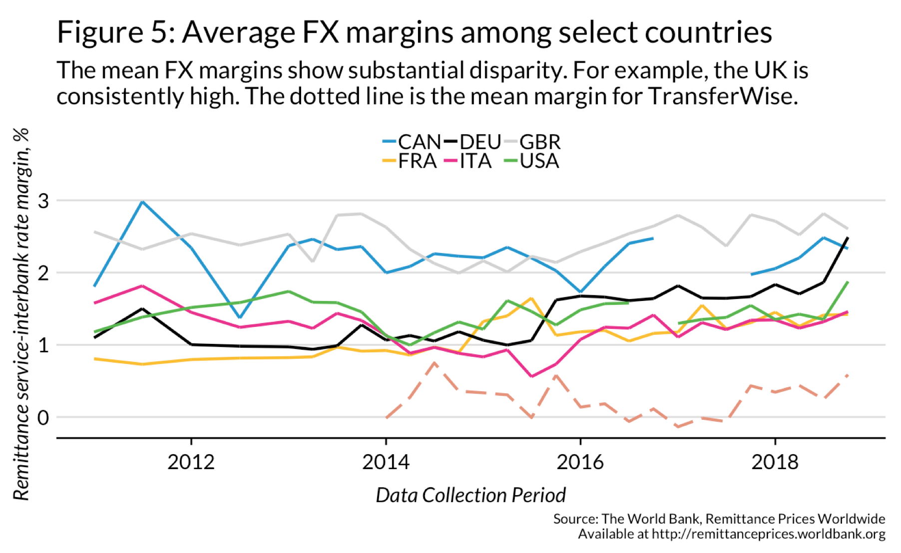

It is clear from the chart that Wise's average FX margin is less than 1%. This would force other competitors to lower their margins in order to retain their customers.

### **What are some of the core metrics that companies in this domain use to measure success? How is your company performing, based on these metrics?**

Wise is a private company and like all private companies it measures its performance as described in the table below with metrics along with values of company's March 2020 year.

| Metrics                         	| Value                                                                   	| Performance                                                                  	|
|---------------------------------	|-------------------------------------------------------------------------	|------------------------------------------------------------------------------	|
| Fiscal Revenue                  	| 302.6 million pounds                                                    	| Up by 70% compared to last fiscal year                                       	|
| Profitability                   	| 21.3 million pounds                                                     	| Fourth consecutive year of profitability                                     	|
| Customer base                   	| 8 million                                                               	| Up from 6 million the previous year - 33% growth                             	|
| Volume of transaction processed 	| 67 billion punds out of which 42 billion was in cross currency transfer 	| Compared to that company was processing well under 20 billion pounds in 2017 	|

In remittance industry, the main performance metric would be, according to the author, the volume of transactions the company processes annually.

As evident from the table above, company is performing well with a growing customer base and trust.

### **How is your company performing relative to competitors in the same domain?**

Following is the chart that shows top companies by market share in this domain in 2017. At that point, Wise was only 6 years old and still managed to be in top 5. This indicates that company has been performing better than most of its competitors and on top of that it has beaten big names like JP Morgan Chase and Citibank.

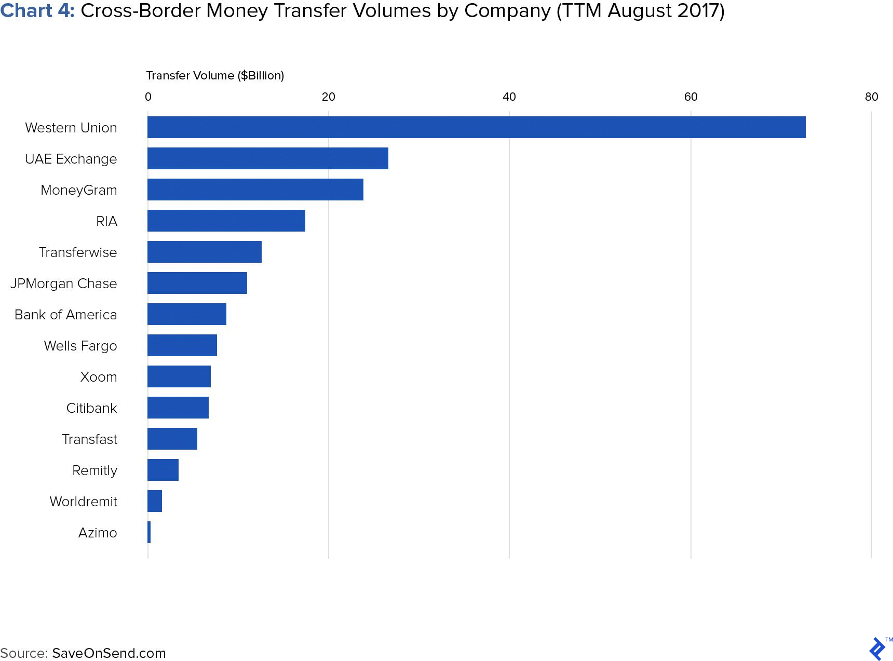
 

## **Recommendations**

### **If you were to advise the company, what products or services would you suggest they offer? (This could be something that a competitor offers, or use your imagination!)**

An idea that the company can implement is opening a money transfer marketplace. Basically, an Uber for money transfer, especially international momeny transfer.

Basically, the idea is to allow users to sign up on the platform and they can either offer other users to buy currency at an exchange rate decided by them. This way the sender has the option to choose the provider they want. Once the sender decides the provider, sender transfers the fiat currency to the platform which then gets converted to a cryptocurrency, for instance ether. That ether is transferred to the provider who then transfers money to the receiver.

Platform makes a small commission of provider's margin and provider also makes while ensuring that the sender gets the best possible rate. All of this will be governed by smart contracts so that there is no fraud.

Platform will be a private blockchain which the company can control so that there is some sort of oversight on the users.

### **Why do you think that offering this product or service would benefit the company?**

This platform would allow the company to make the entire process of money transfer transparent and competitive. Currently, the company only operates in countries it has its bank accounts in but this would allow the company to reach people where it's currently not operating. Thus furthering its reach.

### **What technologies would this additional product or service utilize?**

In order to decentralise money transfer, blockchain technology will be the best way to go in order to execute smart contracts. Network like Ethereum will be an appropriate choice to begin with as Ether tokens can be used to transfer money and to quickly test out the product.

If the product gets accepted, the company can look to create its own token if it wants.

### **Why are these technologies appropriate for your solution?**

These technologies are appropriate because they have been powering other decentralised applications like Bitcoin, Uniswap etc and they have proven that they work. Blockchain technology protects the privacy of the users as well as protects against malicious attacks and smart contracts make sure the platform is fraud tolerant.

## **Addendum**

1. [Wise wikipedia](https://en.wikipedia.org/wiki/Wise_(company))
2. [Igor Gorbatko Medium Article](https://medium.com/@igorbatko/growthstory-how-transferwise-is-building-a-new-global-financial-services-brand-96ec973a082e#:~:text=Like%20most%20great%20products%2C%20TransferWise,hidden%20inside%20the%20exchange%20rate)
3. [Paypal vs Wise](https://www.mobiletransaction.org/paypal-vs-transferwise/)
4. [Wise Tech Stack](https://stackshare.io/transferwise/transferwise)
5. [Venture Scanner Article](https://www.venturescanner.com/2019/12/21/financial-technology-sector-overview-q3-2019-update/)
6. [Remittacne Wikipedia](https://en.wikipedia.org/wiki/Remittance)
[FinTech Investopedia](https://www.investopedia.com/terms/f/fintech.asp)
7. [TransferWise becomes Wise - sifted article](https://sifted.eu/articles/transferwise-becomes-wise/#:~:text=Meet%20'Wise'.,Kristo%20K%C3%A4%C3%A4rmann%2C%20CEO%20and%20cofounder.)
8. [Hawala System](https://www.investopedia.com/terms/h/hawala.asp)
9. [Hawala System - how it works image](https://www.gdrc.org/icm/hawala.html)
10. [Funding - Golden.com article](https://golden.com/wiki/TransferWise-PYEEAG)
11. [Wise Story](https://wise.com/au/about/our-story)
12. [Remittance size](https://aitegroup.com/report/cross-border-remittances-fuel-global-economy)
13. [Business Insider Report](https://www.businessinsider.com/the-digital-remittances-report-2018-12?r=AU&IR=T)
14. [Stack share](https://stackshare.io/transferwise/transferwise/main)
15. [Wise Platform Team - Medium article](https://medium.com/transferwise-engineering/introduction-to-the-wise-platform-team-b4dffe9d7390)
16. [Wise Market share](https://www.toptal.com/finance/market-research-analysts/international-money-transfer)
17. [Wise competitors](https://biz30.timedoctor.com/transferwise-review/)
18. [Traditional money transfer](https://paymentinstitutions.eu/wp-content/uploads/2017/08/Money_remittance.pdf)
19. [Reinvenrting remittance with Bitcoin](images/Reinventing_Remittances_with_Bitcoin_v201702.pdf)
20. [FX Margin - Medium article](https://medium.com/@rikimatsumoto/how-transferwise-is-radically-reducing-the-cost-of-sending-remittances-668f3726a848)
21. [Wise performance March 2020](https://techcrunch.com/2020/09/22/transferwise-reports-accelerating-revenue-growth-to-70-in-its-march-2020-fiscal-year/)

